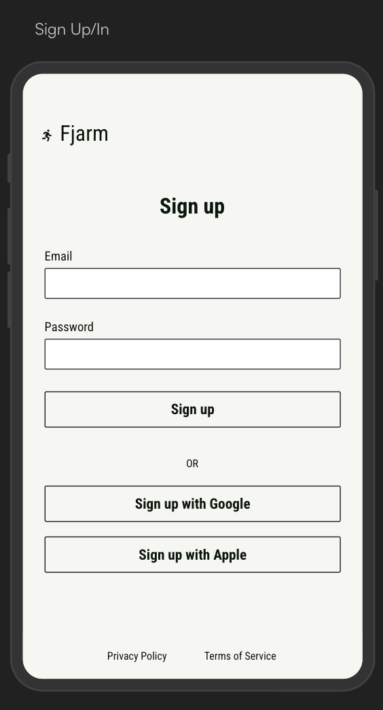

## Feature summary

The login feature enables users with existing Fjarm accounts to authenticate by typing in an email
and password combination.

Successful authentication keeps the user logged in for up to 7 days without activity.

## User stories

As an existing Fjarm user, I want to log in with my credentials so that I can use the app's
features.

When I type in my email address, I want a visual indicator that my input is a valid email address.

After submitting my email address and password, I want to see a visual indicator that my submission
is being processed.

If the submitted credentials are correct, I want to be navigated to the home screen.

If the submitted credentials are incorrect, I want to see an error message.

## UI overview

| Login screen                     |
|----------------------------------|
| [](login.png) |

## High level architecture - client

`LoginContract.kt`

State:

* Title line
* Subtitle line
* Email address input hint text
* Email address input validity color
* Password input hint text
* Log in button text
* Log in button enabled/disabled
* Loading indicator visible/gone

Events:
* Type email address
* Click log in button

Side effects:
* Navigate to home
* Show error message

## High level architecture - API

Endpoints:
* `/fjarm.authentication.v1.AuthenticationService/SubmitAuthentication`

Logging in is a mutation operation (variant of Create - see AIP-133 and AIP-136) that is made
idempotent to handle network retries.

### 1. Request Handling & Idempotency
* **Client Side:** The `LoginRepository` generates a unique `idempotency_key` (UUID) for each login request.
    * If the network fails and the user retries the same attempt, the same key is reused.
* **Server Side:** The server caches successful responses in Redis keyed by `authentication:submit:idempotency:{idempotency_key}` with a minimal TTL (30 seconds).
* **Security:** The idempotency cache is bound to the `install_id` and client's IP address.
    * That is, if the `:{idempotency_key}` part of the cache key returns a value with a different `install_id` (device ID) or IP address hash, the request is rejected to prevent replay attacks.

### 2. Server-Side Verification
1. **Rate Limiting:** Server checks a Token Bucket (Key: IP). This permits small bursts (double-taps) but prevents brute-force.
2. **Credential Fetch:** Server fetches the stored **Argon2id** password hash for the email.
3. **Enumeration Protection:** If the email does not exist, the server performs a "dummy" Argon2 hash check with a constant system salt to ensure response times are identical for valid/invalid emails (AIP-193).
4. **Verification:** Server performs a constant-time comparison of the computed hash and the stored hash.

### 3. Session Management
* **Atomic Upsert:** On success, the server performs an `UPSERT` into the `sessions` table with a `UNIQUE(user_id, install_id)` constraint.
* **Token Issuance:** Returns a short-lived `access_token` and a longer-lived `refresh_token`.

### 4. Client Storage
* **Secure Storage:** Tokens are stored in the Android Keystore.
* **Navigation:** On success, the `LoginViewModel` triggers a side effect to navigate to the Home screen.

## Detailed architecture - API

The `LoginRepository` sends the following message type:

```protobuf
// submit_authentication_request.proto
syntax = "proto3";

import "buf/validate/validate.proto";
import "fjarm/users/v1/user_email_address.proto";
import "fjarm/users/v1/user_password.proto";

option go_package = "github.com/fjarm/fjarm/api/pkg/fjarm/authentication/v1";
option java_multiple_files = true;
option java_outer_classname = "SubmitAuthenticationRequestProto";
option java_package = "xyz.fjarm.authentication.v1";

message SubmitAuthenticationRequest {
  optional fjarm.users.v1.UserEmailAddress email_address = 1 [(buf.validate.field).required = true];
  optional fjarm.users.v1.UserPassword password = 2 [(buf.validate.field).required = true];
}
```

The headers **must** include `request_id` for tracing and `idempotency_key` for idempotency.

The response looks like:

```protobuf
// submit_authentication_response.proto
syntax = "proto3";

import "buf/validate/validate.proto";
import "fjarm/authentication/v1/access_token.proto";
import "fjarm/authentication/v1/refresh_token.proto";

option go_package = "github.com/fjarm/fjarm/api/pkg/fjarm/authentication/v1";
option java_multiple_files = true;
option java_outer_classname = "SubmitAuthenticationResponseProto";
option java_package = "xyz.fjarm.authentication.v1";

message SubmitAuthenticationResponse {
  optional fjarm.authentication.v1.AccessToken access_token = 1 [(buf.validate.field).required = true];
  optional fjarm.authentication.v1.RefreshToken refresh_token = 2 [(buf.validate.field).required = true];
}
```

And the service tying them together looks like:

```protobuf
// authentication_service.proto
syntax = "proto3";

import "buf/validate/validate.proto";
import "fjarm/authentication/v1/submit_authentication_request.proto";
import "fjarm/authentication/v1/submit_authentication_response.proto";

option go_package = "github.com/fjarm/fjarm/api/pkg/fjarm/authentication/v1";
option java_multiple_files = true;
option java_outer_classname = "AuthenticationServiceProto";
option java_package = "xyz.fjarm.authentication.v1";

service AuthenticationService {
  rpc SubmitAuthentication(fjarm.authentication.v1.SubmitAuthenticationRequest) returns (fjarm.authentication.v1.SubmitAuthenticationResponse);
}
```

## Testing - client

- [ ] Given an unauthenticated user, when they type an invalid email address, then they see a visual indicator that the email address is invalid.
- [ ] Given an unauthenticated user, when they type a valid email address, then they see a visual indicator that the email address is valid.
- [ ] Given an unauthenticated user, when they click the log in button, then they see a visual indicator that the submission is being processed.
- [ ] Given an unauthenticated user, when they enter valid credentials, then they are navigated to the Home screen.
- [ ] Given an unauthenticated user, when they enter valid credentials, then the access token and refresh token are stored in the Android Keystore.
- [ ] Given an unauthenticated user, when they enter invalid credentials, then they see an error message.

## Monitoring - client

**Screen performance**
- [ ] Time to first composition
- [ ] Recomposition counts (detect unnecessary recompositions)
- [ ] Frame render time and jank detection
- [ ] Screen load duration

**User actions**
- [ ] Type email address
- [ ] Click log in button
- [ ] Back button clicks
